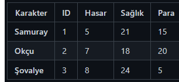
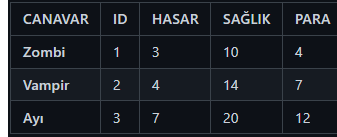
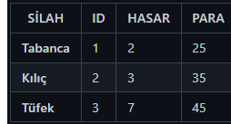
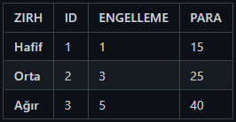

# Currently under development...

# JavaAdventureGame

## 📖 Introduction

Welcome to **JavaAdventureGame**, a text-based adventure game currently under development. Built with Java, this game immerses players in a world filled with thrilling battles, quests, and choices. Prepare to face fierce enemies, gather resources, and explore multiple locations as you fight to survive and thrive.

## 🎮 Gameplay Overview

In this adventure, players will navigate through various locations, encounter obstacles, and collect valuable items. The choices you make will determine your fate in this adventure world. Will you survive the wilderness?

## 🦸 Characters

Choose from a roster of unique characters, each with their strengths and skills to help you tackle obstacles and navigate through the game’s challenges.

## 👾 Obstacles

Encounter a range of foes with unique traits and difficulties. Be prepared to engage in combat, as each location presents different challenges.

## 🗡️ Weapons

Equip yourself with a variety of weapons to enhance your combat abilities:
- **Pistol**
- **Sword**
- **Rifle**

## 🛡️ Armors

Protect yourself with armors ranging from **Light** to **Heavy**, each providing different levels of protection in battle:
- **Light Armor**
- **Medium Armor**
- **Heavy Armor**

## 🗺️ Locations

Explore diverse locations, each offering different features, items, and foes to face:

- **Safe House**
  - **Feature**: Restores player health completely.

- **Cave**
  - **Obstacle**: Zombies (1-3)
  - **Feature**: Combat encounters with a chance to loot.
  - **Item**: Food

- **Forest**
  - **Obstacle**: Vampires (1-3)
  - **Feature**: Combat encounters with a chance to loot.
  - **Item**: Firewood

- **River**
  - **Obstacle**: Bears (1-3)
  - **Feature**: Combat encounters with a chance to loot.
  - **Item**: Water

- **Toolstore**
  - **Feature**: Purchase items to aid in your journey.
  - **Weapons Available**: Pistol, Sword, Rifle
  - **Armors Available**: Light, Medium, Heavy

## 🚧 Development Status

The game is currently in development, with more features and improvements to come. Stay tuned for updates on new locations, items, and gameplay elements.

## 🤝 Contributing

Contributions are welcome! If you're interested in contributing, please follow these steps:
1. Fork the repository.
2. Create a new branch (`git checkout -b feature-branch`).
3. Commit your changes (`git commit -m 'Add new feature'`).
4. Push to the branch (`git push origin feature-branch`).
5. Create a Pull Request.

## 📜 License

This project is licensed under the MIT License - see the [LICENSE](LICENSE) file for details.
